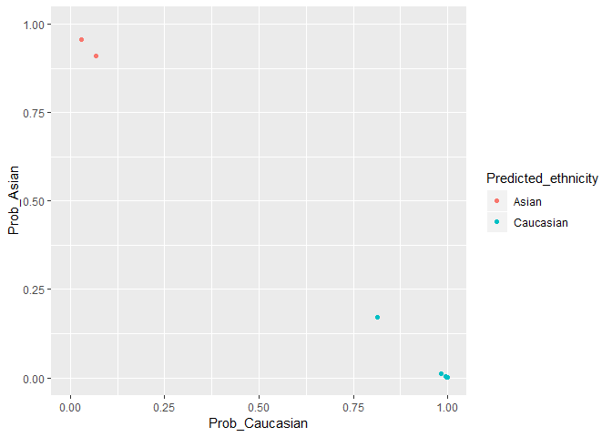

plmec
=====

`plmec` is an R package for inferring ethnicity from placental DNA
methylation microarray data.

Installation
------------

    library(devtools)
    install_github('wvictor14/plmec')

Usage
-----

### Example Data

For examples I download some [placental DNAm GEO
data](https://www.ncbi.nlm.nih.gov/geo/query/acc.cgi?acc=GSE75196) from
an study including Australian samples. To save on memory, I only use
8/24 samples saved in this repo as an `minfi::RGChannelSet` object,
which is can be [loaded from idat
files](https://bioconductor.org/packages/release/bioc/vignettes/minfi/inst/doc/minfi.html#3_reading_data).

    library(plmec)
    library(minfi)      # for normalization
    library(wateRmelon) # for normalization
    library(ggplot2)    

    data(pl_rgset)
    pl_rgset # 8 samples

    ## class: RGChannelSet 
    ## dim: 622399 8 
    ## metadata(0):
    ## assays(2): Green Red
    ## rownames(622399): 10600313 10600322 ... 74810490 74810492
    ## rowData names(0):
    ## colnames(8): GSM1944959_9376561070_R05C01
    ##   GSM1944960_9376561070_R06C01 ... GSM1944965_9376561070_R05C02
    ##   GSM1944966_9376561070_R06C02
    ## colData names(0):
    ## Annotation
    ##   array: IlluminaHumanMethylation450k
    ##   annotation: ilmn12.hg19

Because the data used to train the ethnicity classifier was normalized,
I recommend using the same normalization procedures.

Here we apply `minfi::preprocessNoob()` and `wateRmelon::BMIQ()` to
normalize the methylation data:

    pl_noob <- preprocessNoob(pl_rgset)
    pl_bmiq <- BMIQ(pl_noob)

and then we combine this with the 65 snp probe data (will be 59 SNPs if
using EPIC).

    pl_snps <- getSnpBeta(pl_rgset)
    pl_dat <- rbind(pl_bmiq, pl_snps)
    dim(pl_dat) # 485577     8

    ## [1] 485577      8

### Infer ethnicity

The reason we added the snp data onto the betas matrix was because a
subset of those are used to predict ethnicity. The input data needs to
contain all 1862 features in the final model. We can check this our data
for these features with the `pl_ethnicity_features` vector.

    all(pl_ethnicity_features %in% rownames(pl_dat))

    ## [1] TRUE

You don't need to subset to these 1862 features before running
`pl_ethnicity_infer()` to obtain ethnicity calls:

    dim(pl_dat)

    ## [1] 485577      8

    results <- pl_infer_ethnicity(pl_dat)

    ## [1] "1862 of 1862 predictors present."

    head(results)

    ##                                                 Sample_ID
    ## GSM1944959_9376561070_R05C01 GSM1944959_9376561070_R05C01
    ## GSM1944960_9376561070_R06C01 GSM1944960_9376561070_R06C01
    ## GSM1944961_9376561070_R01C02 GSM1944961_9376561070_R01C02
    ## GSM1944962_9376561070_R02C02 GSM1944962_9376561070_R02C02
    ## GSM1944963_9376561070_R03C02 GSM1944963_9376561070_R03C02
    ## GSM1944964_9376561070_R04C02 GSM1944964_9376561070_R04C02
    ##                              Predicted_ethnicity_nothresh
    ## GSM1944959_9376561070_R05C01                        Asian
    ## GSM1944960_9376561070_R06C01                    Caucasian
    ## GSM1944961_9376561070_R01C02                        Asian
    ## GSM1944962_9376561070_R02C02                    Caucasian
    ## GSM1944963_9376561070_R03C02                    Caucasian
    ## GSM1944964_9376561070_R04C02                    Caucasian
    ##                              Predicted_ethnicity Prob_African   Prob_Asian
    ## GSM1944959_9376561070_R05C01               Asian 0.0116803725 0.9610366943
    ## GSM1944960_9376561070_R06C01           Caucasian 0.0143189207 0.1398351332
    ## GSM1944961_9376561070_R01C02               Asian 0.0206390347 0.9104669237
    ## GSM1944962_9376561070_R02C02           Caucasian 0.0007663899 0.0007906337
    ## GSM1944963_9376561070_R03C02           Caucasian 0.0027674764 0.0036634367
    ## GSM1944964_9376561070_R04C02           Caucasian 0.0057602852 0.0102684594
    ##                              Prob_Caucasian Highest_Prob
    ## GSM1944959_9376561070_R05C01     0.02728293    0.9610367
    ## GSM1944960_9376561070_R06C01     0.84584595    0.8458459
    ## GSM1944961_9376561070_R01C02     0.06889404    0.9104669
    ## GSM1944962_9376561070_R02C02     0.99844298    0.9984430
    ## GSM1944963_9376561070_R03C02     0.99356909    0.9935691
    ## GSM1944964_9376561070_R04C02     0.98397126    0.9839713

    qplot(data = results, x = Prob_Caucasian, y = Prob_African, 
         col = Predicted_ethnicity, xlim = c(0,1), ylim = c(0,1))

    qplot(data = results, x = Prob_Caucasian, y = Prob_Asian, 
         col = Predicted_ethnicity, xlim = c(0,1), ylim = c(0,1))

The results for the whole (n=24) dataset are 22/24 = predicted
Caucasian, 2/24 predicted Asian.

We can't compare this to self-reported ethnicity as it is unavailable.
But we know these samples were collected in Sydney, Australia, and are
therefore likely mostly European with some Asian ancestries.

    table(results$Predicted_ethnicity)

    ## 
    ##     Asian Caucasian 
    ##         2         6
