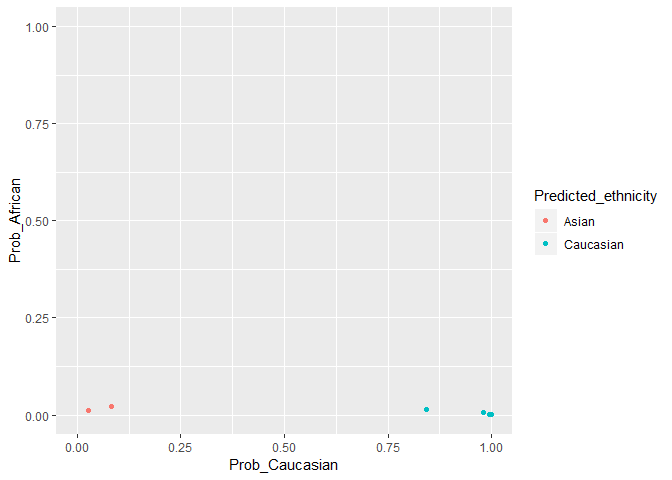
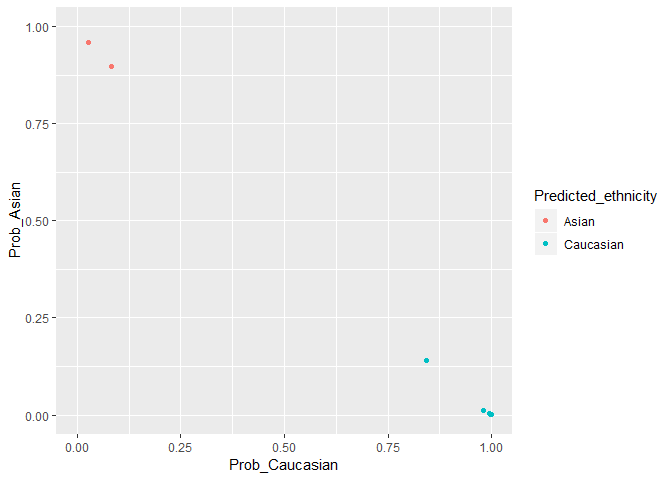

plmec
=====

`plmec` is an R package for inferring ethnicity from placental DNA
methylation microarray data.

Installation
------------

    library(devtools)
    install_github('wvictor14/plmec')

Usage
-----

### Example Data

For demonstration purposes, I downloaded a [placental DNAm dataset from
GEO](https://www.ncbi.nlm.nih.gov/geo/query/acc.cgi?acc=GSE75196), which
contains samples collected in an Australian population. To save on
memory, I only use 8/24 samples, which I have saved in this repo as a
`minfi::RGChannelSet` object.

    library(plmec)
    library(minfi)      # for normalization
    library(wateRmelon) # for normalization
    library(ggplot2)    

    data(pl_rgset)
    pl_rgset # 8 samples

    ## class: RGChannelSet 
    ## dim: 622399 8 
    ## metadata(0):
    ## assays(2): Green Red
    ## rownames(622399): 10600313 10600322 ... 74810490 74810492
    ## rowData names(0):
    ## colnames(8): GSM1944959_9376561070_R05C01
    ##   GSM1944960_9376561070_R06C01 ... GSM1944965_9376561070_R05C02
    ##   GSM1944966_9376561070_R06C02
    ## colData names(0):
    ## Annotation
    ##   array: IlluminaHumanMethylation450k
    ##   annotation: ilmn12.hg19

### Preprocessing data

Ideally, your data should be normalized in the same manner as the
training data used to develop the ethnicity-predictive model. If IDATs
are supplied, you can apply both
[noob](https://www.ncbi.nlm.nih.gov/pmc/articles/PMC3627582/) and
[BMIQ](https://www.ncbi.nlm.nih.gov/pmc/articles/PMC3546795/)
normalization. If only methylated and unmethylated data matrices are
available, you can apply just BMIQ. If neither are available, then you
can still run the algorithm but any differences resulting from the
different normalizations may impact accuracy.

To apply normalization, run `minfi::preprocessNoob()` and then
`wateRmelon::BMIQ()`:

    pl_noob <- preprocessNoob(pl_rgset)
    pl_bmiq <- BMIQ(pl_noob)

Combine the methylation data with the 65 snp probe data (59 SNPs, if
using EPIC):

    pl_snps <- getSnpBeta(pl_rgset)
    pl_dat <- rbind(pl_bmiq, pl_snps)
    dim(pl_dat) # 485577     8

    ## [1] 485577      8

### Infer ethnicity

The reason we added the snp data onto the betas matrix was because a
subset of those are used to predict ethnicity. The input data needs to
contain all 1862 features in the final model. We can check our data for
these features with the `pl_ethnicity_features` vector:

    all(pl_ethnicity_features %in% rownames(pl_dat))

    ## [1] TRUE

You don't need to subset to these 1862 features before running
`pl_ethnicity_infer()` to obtain ethnicity calls:

    dim(pl_dat)

    ## [1] 485577      8

    results <- pl_infer_ethnicity(pl_dat)

    ## [1] "1862 of 1862 predictors present."

    print(results, row.names = F)

    ##                     Sample_ID Predicted_ethnicity_nothresh
    ##  GSM1944959_9376561070_R05C01                        Asian
    ##  GSM1944960_9376561070_R06C01                    Caucasian
    ##  GSM1944961_9376561070_R01C02                        Asian
    ##  GSM1944962_9376561070_R02C02                    Caucasian
    ##  GSM1944963_9376561070_R03C02                    Caucasian
    ##  GSM1944964_9376561070_R04C02                    Caucasian
    ##  GSM1944965_9376561070_R05C02                    Caucasian
    ##  GSM1944966_9376561070_R06C02                    Caucasian
    ##  Predicted_ethnicity Prob_African   Prob_Asian Prob_Caucasian Highest_Prob
    ##                Asian 0.0127130385 0.9604674649     0.02681950    0.9604675
    ##            Caucasian 0.0151894719 0.1415606528     0.84324988    0.8432499
    ##                Asian 0.0209033967 0.8973518606     0.08174474    0.8973519
    ##            Caucasian 0.0006452899 0.0006345267     0.99872018    0.9987202
    ##            Caucasian 0.0025423532 0.0033020695     0.99415558    0.9941556
    ##            Caucasian 0.0070563811 0.0123507595     0.98059286    0.9805929
    ##            Caucasian 0.0017155738 0.0018062623     0.99647816    0.9964782
    ##            Caucasian 0.0008453991 0.0013425324     0.99781207    0.9978121

Note the two columns `Predicted_ethnicity_nothresh` and
`Predicted_ethnicity`. The latter refers to the classification which is
determined by the highest class-specific probability. The former first
applies a cutoff to the highest class-specific probability to determine
if a sample can be confidently classified to a single ethnicity group.
If a sample fails this threshold, this can be often because of mixed
ancestry, and the sample is given an `Ambiguous` label. The default
threshold is 0.75.

    qplot(data = results, x = Prob_Caucasian, y = Prob_African, 
         col = Predicted_ethnicity, xlim = c(0,1), ylim = c(0,1))

    qplot(data = results, x = Prob_Caucasian, y = Prob_Asian, 
         col = Predicted_ethnicity, xlim = c(0,1), ylim = c(0,1))

\*For the entire dataset (not just the subset shown here), 22/24 were
predicted Caucasian and 2/24 Asian.

We can't compare this to self-reported ethnicity as it is unavailable.
But we know these samples were collected in Sydney, Australia, and are
therefore likely mostly European with some Asian ancestries.

    table(results$Predicted_ethnicity)

    ## 
    ##     Asian Caucasian 
    ##         2         6

### Adjustment in differential methylation analysis

Because 'Ambiguous' samples might have different mixtures of ancestries,
it might be inaccurate to adjust for them as one group in an analysis of
admixed populations. (In retrospect, I should have called samples
`African/Asian`, `African/Caucasian`, `Asian/Caucasian` as opposed to
all as `Ambiguous`). Instead, I recommend adjusting for the actual
probabilities in a linear modelling analysis, and to use only 2/3 of the
probabilities, since the third will be redundant (probabilities sum to
1).
