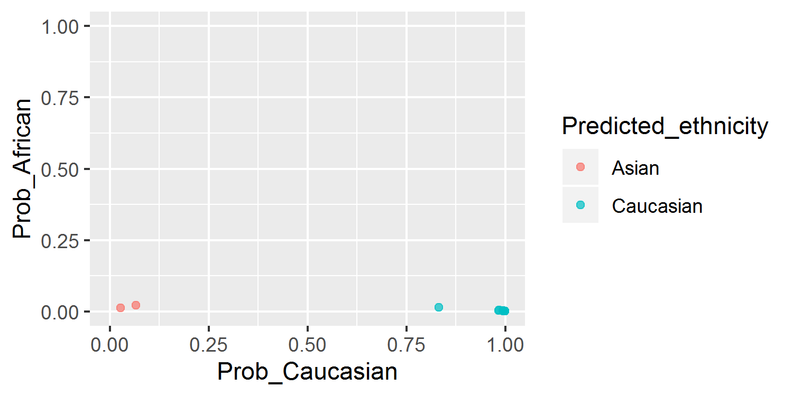
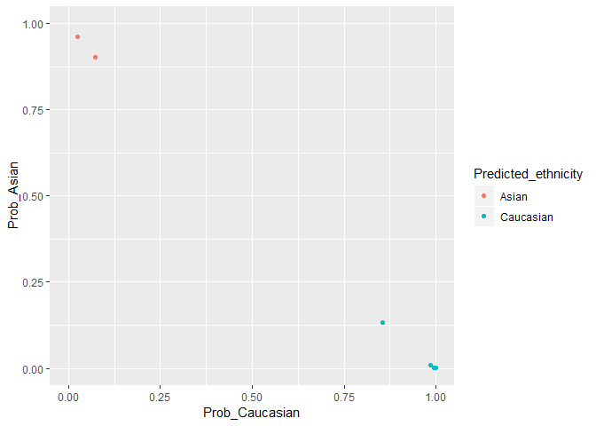

plmec
=====

`plmec` is an R package for inferring ethnicity from placental DNA methylation microarray data \[1\].

Installation
------------

You can install from this github repo with:

``` r
library(devtools)
install_github('wvictor14/plmec')
```

Usage
-----

### Example Data

For demonstration purposes, I downloaded a [placental DNAm dataset from GEO](https://www.ncbi.nlm.nih.gov/geo/query/acc.cgi?acc=GSE75196) \[2\], which contains samples collected in an Australian population. To save on memory, I only use 8/24 samples, which I have saved in this repo as a `minfi::RGChannelSet` object.

``` r
library(plmec)
library(minfi)      # for normalization
library(wateRmelon) # for normalization
library(ggplot2)    

data(pl_rgset)
pl_rgset # 8 samples
#> class: RGChannelSet 
#> dim: 622399 8 
#> metadata(0):
#> assays(2): Green Red
#> rownames(622399): 10600313 10600322 ... 74810490 74810492
#> rowData names(0):
#> colnames(8): GSM1944959_9376561070_R05C01
#>   GSM1944960_9376561070_R06C01 ... GSM1944965_9376561070_R05C02
#>   GSM1944966_9376561070_R06C02
#> colData names(0):
#> Annotation
#>   array: IlluminaHumanMethylation450k
#>   annotation: ilmn12.hg19
```

### Preprocessing data

I highly recommend to normalize your data using the same methods I used to normalize the training data.

This is because every normalization method addresses technical variability differently, and so other normalizations may not result in data on the same scale. Just note that using the same normalization methods will not gaurantee removal of *all* systemic dataset -specific effects. If IDATs are supplied, you can apply both [noob](https://www.ncbi.nlm.nih.gov/pmc/articles/PMC3627582/) \[3\] and [BMIQ](https://www.ncbi.nlm.nih.gov/pmc/articles/PMC3546795/) \[4\] normalization. If only methylated and unmethylated data matrices are available, you can apply just `BMIQ`.

To apply normalization, run `minfi::preprocessNoob()` and then `wateRmelon::BMIQ()`:

``` r
pl_noob <- preprocessNoob(pl_rgset)
pl_bmiq <- BMIQ(pl_noob)
```

Combine the methylation data with the 65 snp probe data (59 SNPs, if using EPIC):

``` r
pl_snps <- getSnpBeta(pl_rgset)
pl_dat <- rbind(pl_bmiq, pl_snps)
dim(pl_dat) # 485577     8
#> [1] 485577      8
```

### Infer ethnicity

The reason we added the snp data onto the betas matrix was because a subset of those are used to predict ethnicity. The input data needs to contain all 1860 features in the final model. We can check our data for these features with the `pl_ethnicity_features` vector:

``` r
all(pl_ethnicity_features %in% rownames(pl_dat))
#> [1] TRUE
```

You don't need to subset to these 1860 features before running `pl_ethnicity_infer()` to obtain ethnicity calls:

``` r
dim(pl_dat)
#> [1] 485577      8
results <- pl_infer_ethnicity(pl_dat)
#> [1] "1860 of 1860 predictors present."
print(results, row.names = F)
#>                     Sample_ID Predicted_ethnicity_nothresh
#>  GSM1944959_9376561070_R05C01                        Asian
#>  GSM1944960_9376561070_R06C01                    Caucasian
#>  GSM1944961_9376561070_R01C02                        Asian
#>  GSM1944962_9376561070_R02C02                    Caucasian
#>  GSM1944963_9376561070_R03C02                    Caucasian
#>  GSM1944964_9376561070_R04C02                    Caucasian
#>  GSM1944965_9376561070_R05C02                    Caucasian
#>  GSM1944966_9376561070_R06C02                    Caucasian
#>  Predicted_ethnicity Prob_African   Prob_Asian Prob_Caucasian Highest_Prob
#>                Asian 0.0125312749 0.9592702657     0.02819846    0.9592703
#>            Caucasian 0.0157535416 0.1746568102     0.80958965    0.8095896
#>                Asian 0.0195976066 0.8948468381     0.08555556    0.8948468
#>            Caucasian 0.0006803084 0.0007479852     0.99857171    0.9985717
#>            Caucasian 0.0022916097 0.0027075185     0.99500087    0.9950009
#>            Caucasian 0.0064293920 0.0110986536     0.98247195    0.9824720
#>            Caucasian 0.0016189745 0.0018583281     0.99652270    0.9965227
#>            Caucasian 0.0011262783 0.0017927473     0.99708097    0.9970810
```

Note the two columns `Predicted_ethnicity_nothresh` and `Predicted_ethnicity`. The latter refers to the classification which is determined by the highest class-specific probability. The former first applies a cutoff to the highest class-specific probability to determine if a sample can be confidently classified to a single ethnicity group. If a sample fails this threshold, this indicates mixed ancestry, and the sample is given an `Ambiguous` label. The default threshold is `0.75`.

``` r
qplot(data = results, x = Prob_Caucasian, y = Prob_African, 
     col = Predicted_ethnicity, xlim = c(0,1), ylim = c(0,1))
```



``` r
qplot(data = results, x = Prob_Caucasian, y = Prob_Asian, 
     col = Predicted_ethnicity, xlim = c(0,1), ylim = c(0,1))
```



\*For the entire dataset (not just the subset shown here), 22/24 were predicted Caucasian and 2/24 Asian.

We can't compare this to self-reported ethnicity as it is unavailable. But we know these samples were collected in Sydney, Australia, and are therefore likely mostly European with some East Asian ancestries.

``` r
table(results$Predicted_ethnicity)
#> 
#>     Asian Caucasian 
#>         2         6
```

### Adjustment in differential methylation analysis

Because 'Ambiguous' samples might have different mixtures of ancestries, it might be inaccurate to adjust for them as one group in an analysis of admixed populations. (In retrospect, I should have called samples `African/Asian`, `African/Caucasian`, `Asian/Caucasian` as opposed to all as `Ambiguous`). Instead, I recommend adjusting for the actual probabilities in a linear modelling analysis, and to use only two of the three probabilities, since the third will be redundant (probabilities sum to 1).

References
----------

\[1\] Yuan V, Price M, Del Gobbo G, Cox B, Binder AM, Michels KB, Marsit C, Robinson W: Inferring population structure from placental DNA methylation studies. *In prep.*

\[2\] Yeung KR, Chiu CL, Pidsley R, Makris A, Hennessy A, Lind JM: DNA methylation profiles in preeclampsia and healthy control placentas. Am J Physiol Circ Physiol 2016, 310:H1295–H1303.

\[3\] Triche TJ, Weisenberger DJ, Van Den Berg D, Laird PW, Siegmund KD, Siegmund KD: Low-level processing of Illumina Infinium DNA Methylation BeadArrays. Nucleic Acids Res 2013, 41:e90.

\[4\] Teschendorff AE, Marabita F, Lechner M, Bartlett T, Tegner J, Gomez-Cabrero D, Beck S: A beta-mixture quantile normalization method for correcting probe design bias in Illumina Infinium 450 k DNA methylation data. Bioinformatics 2013, 29:189–96.
