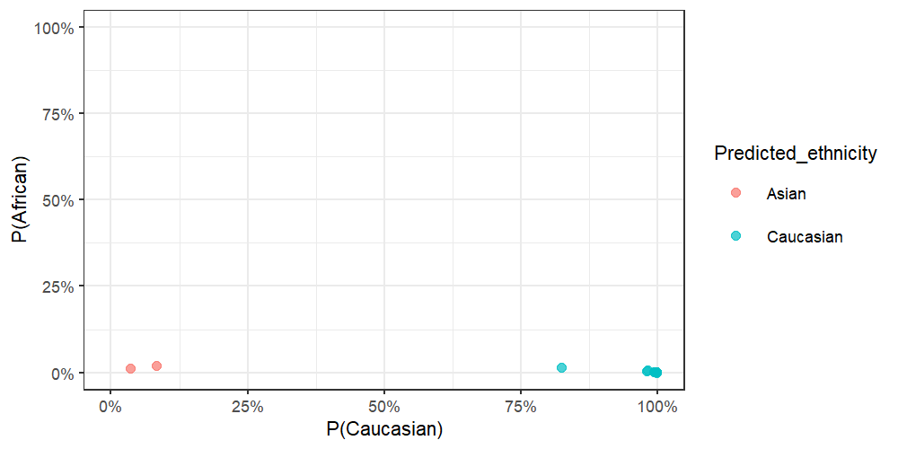
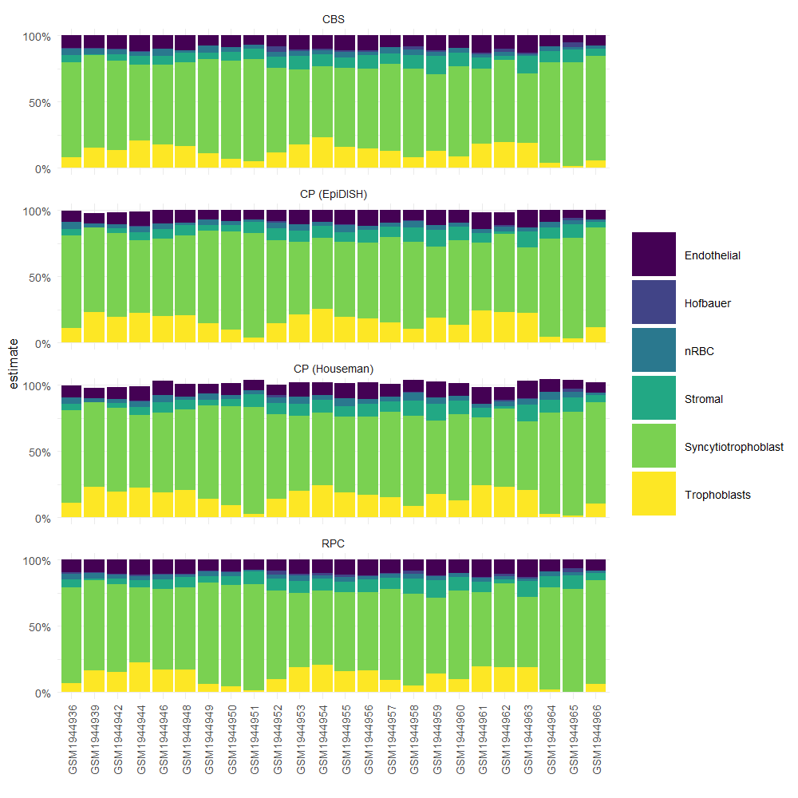

# planet :earth\_americas:

[](https://zenodo.org/badge/latestdoi/157781369)

`planet` is an R package for inferring **ethnicity**, **gestational
age**, and **cell composition** from placental DNA methylation data
[\[1\]\[2\]\[3\]](#references).

  - [Installation](#installation)
  - [Usage](#usage)
      - [Example Data](#example-data)
      - [Infer Ethnicity](#infer-ethnicity)
      - [Infer Gestational Age](#infer-gestational-age)
      - [Infer Cell Composition](#infer-cell-composition)
  - [References](#references---references-)

## Installation

You can install from this github repo with:

``` r
remotes::install_github('wvictor14/planet')
```

*Note: currently, installing with R 3.6.0 results in an warning that can
be circumvented with by setting
R\_REMOTES\_NO\_ERRORS\_FROM\_WARNINGS=“true” for the system
environment variables \#2*

``` r
# Run this if you encounter the above error during install:
withr::with_envvar(
  c(R_REMOTES_NO_ERRORS_FROM_WARNINGS="true"), 
  remotes::install_github('wvictor14/planet')
)
```

## Usage

### Example Data

For demonstration, I use 24 samples from a placental DNAm dataset from
GEO
([GSE7519](https://www.ncbi.nlm.nih.gov/geo/query/acc.cgi?acc=GSE75196))
[\[4\]](#references), which contains samples collected in an Australian
population. The DNA methylation data (in betas) can be accessed with
`data(pl_betas)` and corresponding sample information from
`data(pl_pDat)`. Note that cpgs have been filtered to a random \~10,000
CpGs, plus the CpGs used in all of the models from this package.

``` r
library(planet) 
library(tidyverse)
theme_set(theme_bw(base_size = 8))

#load example data
data(pl_betas)
data(pl_pDat)

dim(pl_betas)
#> [1] 13759    24
head(pl_pDat)
```

<div class="kable-table">

| sample\_id | sex    | disease      | gestation\_wk |
| :--------- | :----- | :----------- | ------------: |
| GSM1944936 | Male   | preeclampsia |            36 |
| GSM1944939 | Male   | preeclampsia |            32 |
| GSM1944942 | Female | preeclampsia |            32 |
| GSM1944944 | Male   | preeclampsia |            35 |
| GSM1944946 | Female | preeclampsia |            38 |
| GSM1944948 | Female | preeclampsia |            36 |

</div>

### Infer Ethnicity

**Requirements:**

  - CpGs and SNPs that are used in `pl_infer_ethnicity` need to be in
    your betas `data.frame`. You can ensure that you have all features
    with the `pl_ethnicity_features` vector:

<!-- end list -->

``` r
all(pl_ethnicity_features %in% rownames(pl_betas))
#> [1] TRUE
```

*Note that if some features are missing, `pl_infer_ethnicity` will throw
a warning, but will still work.*

  - The betas `data.frame` needs to have *samples in columns* and
    *CpGs/snps* in rows. The rownames must be CpG/rs identifiers.
  - If you have IDAT files available, then I recommend normalizing your
    betas `data.frame` using the same normalization methods used on the
    training data:
    [**noob**](https://www.ncbi.nlm.nih.gov/pmc/articles/PMC3627582/)
    [\[5\]](#references) and
    [**BMIQ**](https://www.ncbi.nlm.nih.gov/pmc/articles/PMC3546795/)
    [\[6\]](#references). To apply these, run `minfi::preprocessNoob()`
    on an `rgset` object and then `wateRmelon::BMIQ()`. This has already
    applied to the example data.

<!-- end list -->

``` r
results <- pl_infer_ethnicity(pl_betas)
#> [1] "1860 of 1860 predictors present."

# show last 8 rows
results %>%
  tail(8)
```

<div class="kable-table">

| Sample\_ID | Predicted\_ethnicity\_nothresh | Predicted\_ethnicity | Prob\_African | Prob\_Asian | Prob\_Caucasian | Highest\_Prob |
| :--------- | :----------------------------- | :------------------- | ------------: | ----------: | --------------: | ------------: |
| GSM1944959 | Asian                          | Asian                |     0.0122143 |   0.9606649 |       0.0271208 |     0.9606649 |
| GSM1944960 | Caucasian                      | Caucasian            |     0.0142632 |   0.1545644 |       0.8311723 |     0.8311723 |
| GSM1944961 | Asian                          | Asian                |     0.0215369 |   0.9122843 |       0.0661789 |     0.9122843 |
| GSM1944962 | Caucasian                      | Caucasian            |     0.0007293 |   0.0007500 |       0.9985207 |     0.9985207 |
| GSM1944963 | Caucasian                      | Caucasian            |     0.0023903 |   0.0030573 |       0.9945524 |     0.9945524 |
| GSM1944964 | Caucasian                      | Caucasian            |     0.0058691 |   0.0097200 |       0.9844109 |     0.9844109 |
| GSM1944965 | Caucasian                      | Caucasian            |     0.0016010 |   0.0017434 |       0.9966556 |     0.9966556 |
| GSM1944966 | Caucasian                      | Caucasian            |     0.0009399 |   0.0015500 |       0.9975101 |     0.9975101 |

</div>

`pl_infer_ethnicity` returns probabilities corresponding to each
ethnicity for each sample (e.g `Prob_Caucasian`, `Prob_African`,
`Prob_Asian`). A final classification is determined in two ways:

1.  `Predicted_ethnicity_nothresh` - returns a classification
    corresponding to the highest class-specific probability.

2.  `Predicted_ethnicity` - if the highest class-specific probability is
    below `0.75`, then the the sample is assigned an `Amibiguous` label.
    This threshold can be adjusted with the `threshold` argument.
    Samples with this label might require special attention in
    downstream analyses.

<!-- end list -->

``` r
results %>%
  ggplot(aes(x = Prob_Caucasian, y = Prob_African, col = Predicted_ethnicity)) +
  geom_point(alpha = 0.7) +
  coord_cartesian(xlim = c(0, 1), ylim = c(0, 1)) +
  scale_x_continuous(labels = scales::percent) +
  scale_y_continuous(labels = scales::percent) +
  labs(x = 'P(Caucasian)', y = 'P(African)')
```



``` r

results %>%
  ggplot(aes(x = Prob_Caucasian, y = Prob_Asian, col = Predicted_ethnicity)) +
  geom_point(alpha = 0.7) +
  coord_cartesian(xlim = c(0, 1), ylim = c(0, 1)) +
  scale_x_continuous(labels = scales::percent) +
  scale_y_continuous(labels = scales::percent) +
  labs(x = 'P(Caucasian)', y = 'P(Asian)')
```


We can’t compare this to self-reported ethnicity as it is unavailable.
But we know these samples were collected in Sydney, Australia, and are
therefore likely mostly European with some East Asian ancestries.

``` r
table(results$Predicted_ethnicity)
#> 
#>     Asian Caucasian 
#>         2        22
```

**A note on adjustment in differential methylation analysis**

Because ‘Ambiguous’ samples might have different mixtures of ancestries,
it might be inadequate to adjust for them as one group in an analysis of
admixed populations (e.g. 50/50 Asian/African should not be considered
the same group as 50/50 Caucasian/African). One solution would be to
simply remove these samples. Another would be to adjust for the raw
probabilities-in this case, use only two of the three probabilities,
since the third will be redundant (probabilities sum to 1). If sample
numbers are large enough in each group, stratifying downstream analyses
by ethnicity might also be a valid option.

### Infer Gestational Age

There are 3 gestational age clocks for placental DNA methylation data
from [Lee Y. et al. 2019 \[2\]](#references):

1.  Robust Placental Clock (RPC)
2.  Control Placental Clock (CPC)
3.  Refined Robust Placental Clock (RRPC)

To use each, we can specify the `type` argument in `pl_infer_age`:

``` r
# We will add this information the sample information data.frame, pl_pDat
pl_pDat %>%
  mutate(ga_RPC = pl_infer_age(pl_betas, type = 'RPC'),
         ga_CPC = pl_infer_age(pl_betas, type = 'CPC'),
         ga_RRPC = pl_infer_age(pl_betas, type = 'RRPC')) %>%
  
  # reshape, to plot
  pivot_longer(cols = contains('ga'),
               names_to = 'clock_type',
               names_prefix = 'ga_',
               values_to = 'ga') %>%
  
  ggplot(aes(x = gestation_wk, y = ga, col = disease)) +
  geom_point() +
  geom_smooth(method = 'lm', se = FALSE) +
  facet_wrap(~clock_type) +
  labs(x = 'Reported GA (weeks)', y = 'Inferred GA (weeks)', col = '')
#> [1] "558 of 558 predictors present."
#> [1] "546 of 546 predictors present."
#> [1] "395 of 395 predictors present."
```

 *GA:
gestational age*

### Infer Cell Composition

To infer cell composition on placental villi DNAm samples, we can use
the reference cpgs identified in \[3\]. These are provided in this
package as `pl_cell_cpgs_third` and `pl_cell_cpgs_first` for third
trimester (term) and first trimester samples, respectively.

In this example we are using term villi DNAm data, so we first load the
reference cpgs `pl_cell_cpgs_third`. This is a data frame of 500 cpgs,
with mean methylation levels for each cell type.

``` r
data('pl_cell_cpgs_third')
head(pl_cell_cpgs_third)
#>            Trophoblasts   Stromal  Hofbauer Endothelial      nRBC
#> cg10590657    0.1014098 0.9345796 0.9016368   0.8963641 0.8448382
#> cg14923398    0.1282030 0.8902107 0.9339555   0.9383641 0.9508709
#> cg05348366    0.1305697 0.9519820 0.9088860   0.9065136 0.9278057
#> cg11862144    0.1561991 0.9430855 0.9419634   0.9341671 0.9647331
#> cg17907628    0.1215249 0.9278777 0.9036880   0.8914412 0.9143601
#> cg11552829    0.1436501 0.8783793 0.9561899   0.9446054 0.9490943
```

After our reference cpg data is loaded, we can estimate cell composition
by applying either the Constrained Projection approach implemented by
the R packages `minfi` or `EpiDISH`, or a non-constrained approach by
`EpiDish`.

#### Minfi

``` r
library(minfi)

houseman_estimates <- minfi:::projectCellType(
  pl_betas[rownames(pl_cell_cpgs_third),], 
  pl_cell_cpgs_third,
  lessThanOne = FALSE)

head(houseman_estimates)
#>            Trophoblasts      Stromal     Hofbauer Endothelial       nRBC
#> GSM1944936    0.9036406 0.000000e+00 0.0001173050  0.05715579 0.06975103
#> GSM1944939    0.9467667 0.000000e+00 0.0006780647  0.03398968 0.03850730
#> GSM1944942    0.9165590 4.470134e-19 0.0000000000  0.05881142 0.03790619
#> GSM1944944    0.8493527 1.017575e-03 0.0070579159  0.09159188 0.05578747
#> GSM1944946    0.8747275 2.122237e-02 0.0109528806  0.08365519 0.06530729
#> GSM1944948    0.9081046 1.539855e-02 0.0000000000  0.07604194 0.04153465
```

#### EpiDish

``` r
library(EpiDISH)

# robust partial correlations
epidish_RPC <- epidish(
  beta.m = pl_betas[rownames(pl_cell_cpgs_third),],
  ref.m = pl_cell_cpgs_third,
  method = 'RPC')

# CIBERSORT
epidish_CBS <- epidish(
  beta.m = pl_betas[rownames(pl_cell_cpgs_third),],
  ref.m = pl_cell_cpgs_third,
  method = 'CBS')

# constrained projection (houseman 2012)
epidish_CP <- epidish(
  beta.m = pl_betas[rownames(pl_cell_cpgs_third),],
  ref.m = pl_cell_cpgs_third,
  method = 'CP')
```

#### Compare

We can compare the different cell composition estimates.

``` r
bind_rows(houseman_estimates %>% as.data.frame %>% mutate(algorithm = 'CP (Houseman)'),
          epidish_RPC$estF %>% as.data.frame %>% mutate(algorithm = 'RPC'),
          epidish_CBS$estF %>% as.data.frame %>% mutate(algorithm = 'CBS'),
          epidish_CP$estF %>% as.data.frame %>% mutate(algorithm = 'CP (EpiDISH)')) %>%
  mutate(sample = rep(rownames(houseman_estimates),4)) %>%
  as_tibble() %>%
  pivot_longer(cols = -c(algorithm, sample),
               names_to = 'component',
               values_to = 'estimate') %>%
  

  ggplot(aes(x = sample, y = estimate, fill = component)) +
  geom_bar(stat = 'identity') +
  facet_wrap(~algorithm, ncol = 1) +
  scale_fill_brewer(palette = 'Accent') +
  theme_minimal(base_size = 5) +
  scale_y_continuous(limits = c(-0.1,1.1), breaks = c(0, 0.5, 1), labels = scales::percent) +
  theme(axis.text.x = element_text(angle = 90, vjust = 0.5)) +
  coord_cartesian(ylim = c(0,1)) +
  labs(x = '', fill = '')
```



## References

1.  [**Yuan V**, Price EM, Del Gobbo G, Mostafavi S, Cox B, Binder AM,
    et al. Accurate ethnicity prediction from placental DNA methylation
    data. Epigenetics & Chromatin. 2019 Aug
    9;12(1):51.](https://epigeneticsandchromatin.biomedcentral.com/articles/10.1186/s13072-019-0296-3)

2.  [Lee Y, Choufani S, Weksberg R, Wilson SL, **Yuan V**, et
    al. Placental epigenetic clocks: estimating gestational age using
    placental DNA methylation levels. Aging (Albany NY).
    2019;11(12):4238–4253.
    doi:10.18632/aging.102049](https://www.ncbi.nlm.nih.gov/pmc/articles/PMC6628997/)

3.  [Yuan V et al.]()

4.  Yeung KR, Chiu CL, Pidsley R, Makris A, Hennessy A, Lind JM: DNA
    methylation profiles in preeclampsia and healthy control placentas.
    Am J Physiol Circ Physiol 2016, 310:H1295–H1303.

5.  Triche TJ, Weisenberger DJ, Van Den Berg D, Laird PW, Siegmund KD,
    Siegmund KD: Low-level processing of Illumina Infinium DNA
    Methylation BeadArrays. Nucleic Acids Res 2013, 41:e90.

6.  Teschendorff AE, Marabita F, Lechner M, Bartlett T, Tegner J,
    Gomez-Cabrero D, Beck S: A beta-mixture quantile normalization
    method for correcting probe design bias in Illumina Infinium 450 k
    DNA methylation data. Bioinformatics 2013, 29:189–96.
