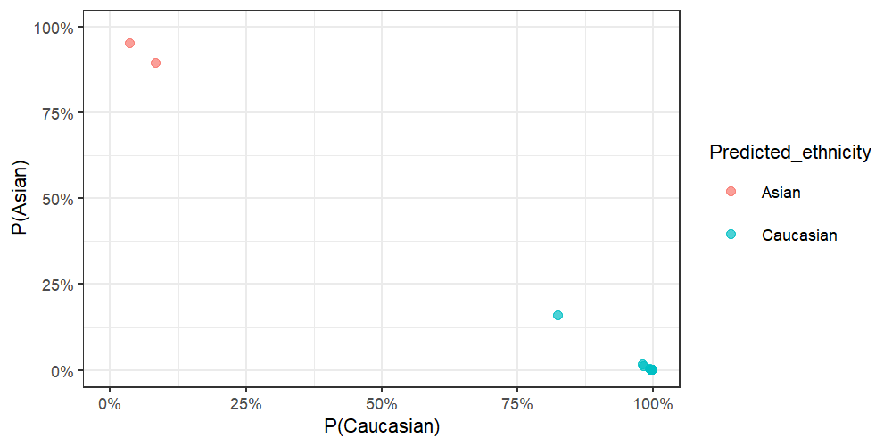

# planet :earth\_americas:

[](https://zenodo.org/badge/latestdoi/157781369)

`planet` is an R package for inferring ethnicity from placental DNA
methylation microarray data \[1\].

## Installation

You can install from this github repo with:

``` r
remotes::install_github('wvictor14/planet')
```

*Note: currently, installing with R 3.6.0 results in an warning that can
be circumvented with by setting
R\_REMOTES\_NO\_ERRORS\_FROM\_WARNINGS=“true” for the system
environment variables \#2*

``` r
# Run this if you encounter the above error during install:
withr::with_envvar(
  c(R_REMOTES_NO_ERRORS_FROM_WARNINGS="true"), 
  remotes::install_github('wvictor14/planet')
)
```

## Usage

### Example Data

For demonstration, I use 24 samples from a [placental DNAm dataset from
GEO
(GSE75196)](https://www.ncbi.nlm.nih.gov/geo/query/acc.cgi?acc=GSE75196)
\[2\], which contains samples collected in an Australian population. The
DNA methylation data (in betas) can be accessed with `data(pl_betas)`
and corresponding sample information from `data(pl_pDat)`. Note that
cpgs have been filtered to a random \~10,000 + CpGs used in the models
from this package.

``` r
library(planet) 
library(tidyverse)    

#load example data
data(pl_betas)
data(pl_pDat)

dim(pl_betas)
#> [1] 12897    24
pl_pDat
#> # A tibble: 24 x 4
#>    sample_id  sex    disease        gestation_wk
#>    <fct>      <chr>  <chr>                 <dbl>
#>  1 GSM1944936 Male   preeclampsia             36
#>  2 GSM1944939 Male   preeclampsia             32
#>  3 GSM1944942 Female preeclampsia             32
#>  4 GSM1944944 Male   preeclampsia             35
#>  5 GSM1944946 Female preeclampsia             38
#>  6 GSM1944948 Female preeclampsia             36
#>  7 GSM1944949 Female preeclampsia             37
#>  8 GSM1944950 Male   preeclampsia             35
#>  9 GSM1944951 Female normal/healthy           39
#> 10 GSM1944952 Male   normal/healthy           38
#> # ... with 14 more rows
```

### Infer ethnicity

**Requirements:**

  - CpGs and SNPs that are used in `pl_infer_ethnicity` need to be in
    your betas `data.frame`. You can ensure that you have all features
    with the `pl_ethnicity_features` vector:

<!-- end list -->

``` r
all(pl_ethnicity_features %in% rownames(pl_betas))
#> [1] TRUE
```

*Note that if some features are missing, `pl_infer_ethnicity` will throw
a warning, but will still work.*

  - The betas `data.frame` needs to have *samples in columns* and
    *CpGs/snps* in rows. The rownames mustbe CpG/rs identifiers.
  - If you have IDAT files available, then I recommend normalizing your
    betas `data.frame` using the same normalization methods used on the
    training data:
    [**noob**](https://www.ncbi.nlm.nih.gov/pmc/articles/PMC3627582/)
    \[3\] and
    [**BMIQ**](https://www.ncbi.nlm.nih.gov/pmc/articles/PMC3546795/)
    \[4\]. To apply these, run `minfi::preprocessNoob()` on an `rgset`
    object and then `wateRmelon::BMIQ()`. This has already applied to
    the example data.

<!-- end list -->

``` r
results <- pl_infer_ethnicity(pl_betas)
#> [1] "1860 of 1860 predictors present."
#> Loading required package: Matrix
#> 
#> Attaching package: 'Matrix'
#> The following objects are masked from 'package:tidyr':
#> 
#>     expand, pack, unpack
print(results, row.names = F)
#>   Sample_ID Predicted_ethnicity_nothresh Predicted_ethnicity Prob_African
#>  GSM1944936                    Caucasian           Caucasian 0.0032635194
#>  GSM1944939                    Caucasian           Caucasian 0.0007510622
#>  GSM1944942                    Caucasian           Caucasian 0.0008438397
#>  GSM1944944                    Caucasian           Caucasian 0.0006315807
#>  GSM1944946                    Caucasian           Caucasian 0.0011125222
#>  GSM1944948                    Caucasian           Caucasian 0.0010425633
#>  GSM1944949                    Caucasian           Caucasian 0.0007091564
#>  GSM1944950                    Caucasian           Caucasian 0.0016598901
#>  GSM1944951                    Caucasian           Caucasian 0.0012222637
#>  GSM1944952                    Caucasian           Caucasian 0.0023798383
#>  GSM1944953                    Caucasian           Caucasian 0.0014259287
#>  GSM1944954                    Caucasian           Caucasian 0.0003693372
#>  GSM1944955                    Caucasian           Caucasian 0.0008445218
#>  GSM1944956                    Caucasian           Caucasian 0.0011051312
#>  GSM1944957                    Caucasian           Caucasian 0.0022290390
#>  GSM1944958                    Caucasian           Caucasian 0.0012032757
#>  GSM1944959                        Asian               Asian 0.0124173980
#>  GSM1944960                    Caucasian           Caucasian 0.0146145824
#>  GSM1944961                        Asian               Asian 0.0191661019
#>  GSM1944962                    Caucasian           Caucasian 0.0005813799
#>  GSM1944963                    Caucasian           Caucasian 0.0022575598
#>  GSM1944964                    Caucasian           Caucasian 0.0055464301
#>  GSM1944965                    Caucasian           Caucasian 0.0019000186
#>  GSM1944966                    Caucasian           Caucasian 0.0009131231
#>    Prob_Asian Prob_Caucasian Highest_Prob
#>  0.0161050230     0.98063146    0.9806315
#>  0.0004868869     0.99876205    0.9987621
#>  0.0007381152     0.99841805    0.9984180
#>  0.0005670175     0.99880140    0.9988014
#>  0.0017893281     0.99709815    0.9970981
#>  0.0011664212     0.99779102    0.9977910
#>  0.0014162003     0.99787464    0.9978746
#>  0.0021329910     0.99620712    0.9962071
#>  0.0028102429     0.99596749    0.9959675
#>  0.0029861681     0.99463399    0.9946340
#>  0.0014420359     0.99713204    0.9971320
#>  0.0005942298     0.99903643    0.9990364
#>  0.0007400218     0.99841546    0.9984155
#>  0.0018314111     0.99706346    0.9970635
#>  0.0029181362     0.99485282    0.9948528
#>  0.0019664758     0.99683025    0.9968302
#>  0.9555934915     0.03198911    0.9555935
#>  0.1581146636     0.82727075    0.8272708
#>  0.9054384627     0.07539544    0.9054385
#>  0.0005910620     0.99882756    0.9988276
#>  0.0028351975     0.99490724    0.9949072
#>  0.0091593270     0.98529424    0.9852942
#>  0.0021322348     0.99596775    0.9959677
#>  0.0013954427     0.99769143    0.9976914
```

`pl_infer_ethnicity` returns probabilities corresponding to each
ethnicity for each sample (e.g `Prob_Caucasian`, `Prob_African`,
`Prob_Asian`). A final classification is determined in two ways:

1.  `Predicted_ethnicity_nothresh` - returns a classification
    corresponding to the highest class-specific probability.

2.  `Predicted_ethnicity` - if the highest class-specific probability is
    below `0.75`, then the the sample is assigned an `Amibiguous` label.
    This threshold can be adjusted with the `threshold` argument.
    Samples with this label might require special attention in
    downstream analyses.

<!-- end list -->

``` r
results %>%
  ggplot(aes(x = Prob_Caucasian, y = Prob_African, col = Predicted_ethnicity)) +
  geom_point(alpha = 0.7) +
  coord_cartesian(xlim = c(0, 1), ylim = c(0, 1))
```


``` r

results %>%
  ggplot(aes(x = Prob_Caucasian, y = Prob_Asian, col = Predicted_ethnicity)) +
  geom_point(alpha = 0.7) +
  coord_cartesian(xlim = c(0, 1), ylim = c(0, 1))
```



We can’t compare this to self-reported ethnicity as it is unavailable.
But we know these samples were collected in Sydney, Australia, and are
therefore likely mostly European with some East Asian ancestries.

``` r
table(results$Predicted_ethnicity)
#> 
#>     Asian Caucasian 
#>         2        22
```

**A note on adjustment in differential methylation analysis**

Because ‘Ambiguous’ samples might have different mixtures of ancestries,
it might be inadequate to adjust for them as one group in an analysis of
admixed populations (e.g. 50/50 Asian/African should not be considered
the same group as 50/50 Caucasian/African). One solution would be to
simply remove these samples. Another would be to adjust for the raw
probabilities-in this case, use only two of the three probabilities,
since the third will be redundant (probabilities sum to 1). If sample
numbers are large enough in each group, stratifying downstream analyses
by ethnicity might also be a valid option.

## References

1.  [Yuan V, Price EM, Del Gobbo G, Mostafavi S, Cox B, Binder AM, et
    al. Accurate ethnicity prediction from placental DNA methylation
    data. Epigenetics & Chromatin. 2019
    Aug 9;12(1):51.](https://epigeneticsandchromatin.biomedcentral.com/articles/10.1186/s13072-019-0296-3)

2.  Yeung KR, Chiu CL, Pidsley R, Makris A, Hennessy A, Lind JM: DNA
    methylation profiles in preeclampsia and healthy control placentas.
    Am J Physiol Circ Physiol 2016, 310:H1295–H1303.

3.  Triche TJ, Weisenberger DJ, Van Den Berg D, Laird PW, Siegmund KD,
    Siegmund KD: Low-level processing of Illumina Infinium DNA
    Methylation BeadArrays. Nucleic Acids Res 2013, 41:e90.

4.  Teschendorff AE, Marabita F, Lechner M, Bartlett T, Tegner J,
    Gomez-Cabrero D, Beck S: A beta-mixture quantile normalization
    method for correcting probe design bias in Illumina Infinium 450 k
    DNA methylation data. Bioinformatics 2013, 29:189–96.
