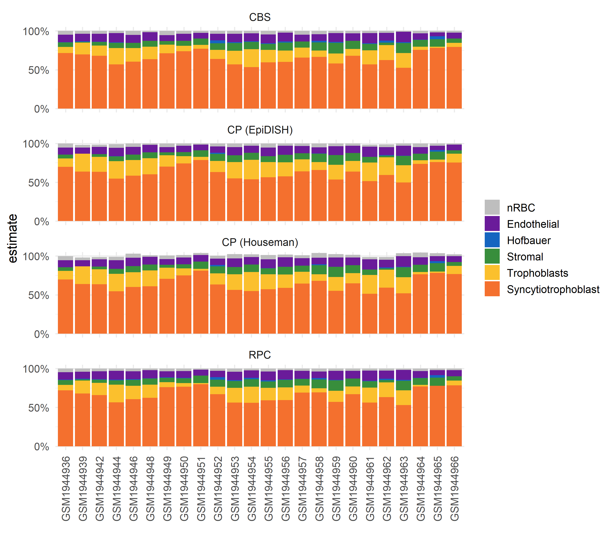

To infer cell composition on placental villi DNAm samples, we can use the
reference cpgs identified in [3]. These are provided in this package as
`pl_cell_cpgs_third` and `pl_cell_cpgs_first` for third trimester (term) and
first trimester samples, respectively.

In this example we are using term villi DNAm data, so we first load the 
reference cpgs `pl_cell_cpgs_third`. This is a data frame of 600 cpgs, with 
mean methylation levels for each cell type.


```r
# cell deconvolution packages
library(minfi)
library(EpiDISH)

# data wrangling and plotting
library(dplyr)
library(ggplot2)
library(tidyr)
library(viridis)

library(planet)

# load example data
data("pl_betas")
data("pl_cell_cpgs_third")
head(pl_cell_cpgs_third)
```

```
##            Trophoblasts   Stromal  Hofbauer
## cg10590657    0.1014098 0.9345796 0.8655285
## cg14923398    0.1282030 0.8902107 0.9036769
## cg05348366    0.1305697 0.9519820 0.8803082
## cg17907628    0.1215249 0.9278777 0.8727841
## cg26799656    0.1259953 0.9482014 0.8803863
## cg11862144    0.1561991 0.9430855 0.9114967
##            Endothelial      nRBC
## cg10590657   0.8963641 0.8448382
## cg14923398   0.9383641 0.9508709
## cg05348366   0.9065136 0.9278057
## cg17907628   0.8914412 0.9143601
## cg26799656   0.8791004 0.9010419
## cg11862144   0.9341671 0.9647331
##            Syncytiotrophoblast
## cg10590657          0.05460441
## cg14923398          0.05383193
## cg05348366          0.06546727
## cg17907628          0.05325227
## cg26799656          0.06823985
## cg11862144          0.06044207
```

After our reference cpg data is loaded, we can estimate cell composition by
applying either the Constrained Projection approach implemented by the R 
packages minfi or EpiDISH, or a non-constrained approach by EpiDish.

#### Minfi


```r
houseman_estimates <- minfi:::projectCellType(
    pl_betas[rownames(pl_cell_cpgs_third), ],
    pl_cell_cpgs_third,
    lessThanOne = FALSE
)

head(houseman_estimates)
```

```
##            Trophoblasts    Stromal      Hofbauer
## GSM1944936    0.1091279 0.04891919  0.000000e+00
## GSM1944939    0.2299918 0.00000000 -1.806592e-19
## GSM1944942    0.1934287 0.03483540  0.000000e+00
## GSM1944944    0.2239896 0.06249135  1.608645e-03
## GSM1944946    0.1894152 0.07935955  0.000000e+00
## GSM1944948    0.2045124 0.07657717  0.000000e+00
##            Endothelial       nRBC
## GSM1944936  0.08983998 0.05294062
## GSM1944939  0.07888007 0.03374149
## GSM1944942  0.09260353 0.02929310
## GSM1944944  0.11040693 0.04447951
## GSM1944946  0.10587439 0.05407587
## GSM1944948  0.09871149 0.02269798
##            Syncytiotrophoblast
## GSM1944936           0.6979477
## GSM1944939           0.6377822
## GSM1944942           0.6350506
## GSM1944944           0.5467642
## GSM1944946           0.6022329
## GSM1944948           0.6085825
```

#### EpiDish


```r
# robust partial correlations
epidish_RPC <- epidish(
    beta.m = pl_betas[rownames(pl_cell_cpgs_third), ],
    ref.m = pl_cell_cpgs_third,
    method = "RPC"
)

# CIBERSORT
epidish_CBS <- epidish(
    beta.m = pl_betas[rownames(pl_cell_cpgs_third), ],
    ref.m = pl_cell_cpgs_third,
    method = "CBS"
)

# constrained projection (houseman 2012)
epidish_CP <- epidish(
    beta.m = pl_betas[rownames(pl_cell_cpgs_third), ],
    ref.m = pl_cell_cpgs_third,
    method = "CP"
)
```

### Compare

We can compare the different cell composition estimates.


```r
data("pl_colors")

# bind estimate data frames and reshape for plotting
bind_rows(
    houseman_estimates %>% as.data.frame() %>% mutate(algorithm = "CP (Houseman)"),
    epidish_RPC$estF %>% as.data.frame() %>% mutate(algorithm = "RPC"),
    epidish_CBS$estF %>% as.data.frame() %>% mutate(algorithm = "CBS"),
    epidish_CP$estF %>% as.data.frame() %>% mutate(algorithm = "CP (EpiDISH)")
) %>%
    mutate(sample = rep(rownames(houseman_estimates), 4)) %>%
    as_tibble() %>%
    pivot_longer(
        cols = -c(algorithm, sample),
        names_to = "component",
        values_to = "estimate"
    ) %>%

    # relevel for plot
    mutate(component = factor(component,
        levels = c(
            "nRBC", "Endothelial", "Hofbauer",
            "Stromal", "Trophoblasts",
            "Syncytiotrophoblast"
        )
    )) %>%

    # plot
    ggplot(aes(x = sample, y = estimate, fill = component)) +
    geom_bar(stat = "identity") +
    facet_wrap(~algorithm, ncol = 1) +
    scale_fill_manual(values = pl_colors) +
    theme_minimal() +
    scale_y_continuous(
        limits = c(-0.1, 1.1), breaks = c(0, 0.5, 1),
        labels = scales::percent
    ) +
    theme(axis.text.x = element_text(angle = 90, vjust = 0.5)) +
    coord_cartesian(ylim = c(0, 1)) +
    labs(x = "", fill = "")
```



### References

1. [Victor Yuan, Desmond Hui, Yifan Yin et al. Cell-specific Characterization 
of the Placental Methylome, 29 October 2020, PREPRINT (Version 3) available at
Research Square](https://www.researchsquare.com/article/rs-38223/v3)
