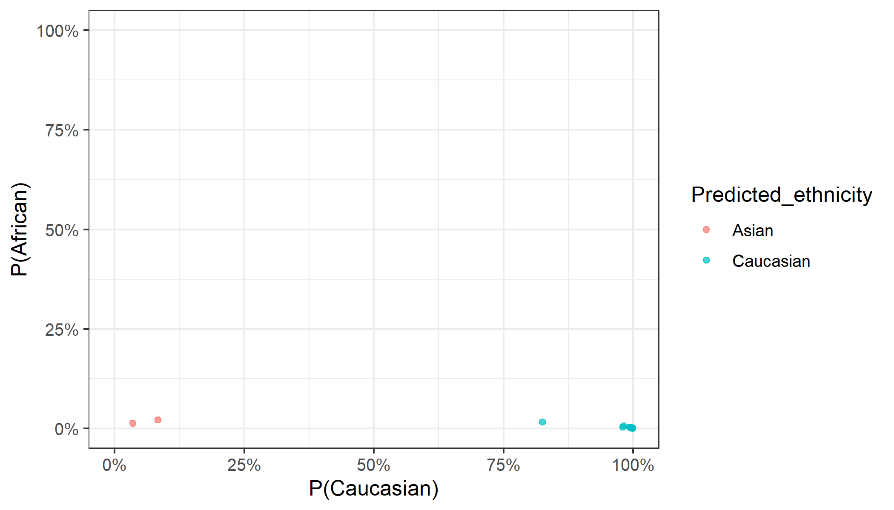

### Example Data

For demonstration, I use 24 samples from a placental DNAm dataset from GEO,
([GSE7519](https://www.ncbi.nlm.nih.gov/geo/query/acc.cgi?acc=GSE75196)), which
contains samples collected in an Australian population. The DNA methylation 
data (in betas) can be accessed with `data(plBetas)` and corresponding sample
information from `data(plPhenoData)`. Note that cpgs have been filtered to a 
random \~10,000 CpGs, plus the CpGs used inall of the models from this package.


```r
library(dplyr) # for data wrangling
library(ggplot2) #  plotting
library(planet)

# load example data
data(plBetas)
data(plPhenoData)

dim(plBetas)
#> [1] 13918    24
head(plPhenoData)
#> # A tibble: 6 x 7
#>   sample_id  sex    disease      gestation_wk ga_RPC ga_CPC ga_RRPC
#>   <fct>      <chr>  <chr>               <dbl>  <dbl>  <dbl>   <dbl>
#> 1 GSM1944936 Male   preeclampsia           36   38.5   38.7    38.7
#> 2 GSM1944939 Male   preeclampsia           32   33.1   34.2    32.6
#> 3 GSM1944942 Female preeclampsia           32   34.3   35.1    33.3
#> 4 GSM1944944 Male   preeclampsia           35   35.5   36.7    35.5
#> 5 GSM1944946 Female preeclampsia           38   37.6   37.6    36.6
#> 6 GSM1944948 Female preeclampsia           36   36.8   38.4    36.7
```

### Infer Ethnicity

**Requirements:**

- CpGs and SNPs that are used in `pl_infer_ethnicity` need to be in your betas
`data.frame`. You can ensure that you have all features with the
`ethnicityCpGs` vector:


```r
all(ethnicityCpGs %in% rownames(plBetas))
#> [1] TRUE
```

*Note that if some features are missing, `pl_infer_ethnicity` will throw a
warning, but will still work.*

- The betas `data.frame` needs to have *samples in columns* and *CpGs/snps* in
rows. The rownames must be CpG/rs identifiers.

- If you have IDAT files available, then I recommend normalizing your betas
`data.frame` using the same normalization methods used on the training data:
[**noob**](https://www.ncbi.nlm.nih.gov/pmc/articles/PMC3627582/) and
[**BMIQ**](https://www.ncbi.nlm.nih.gov/pmc/articles/PMC3546795/). To apply 
these, run `minfi::preprocessNoob()` on an `rgset` object and then
`wateRmelon::BMIQ()`. This has already applied to the example data.


```r
results <- pl_infer_ethnicity(plBetas)
#> Warning: 'pl_infer_ethnicity' is deprecated.
#> Use 'predictEthnicity' instead.
#> See help("Deprecated")

# show last 8 rows
results %>%
    tail(8)
#> # A tibble: 8 x 7
#>   Sample_ID Predicted_ethni~ Predicted_ethni~ Prob_African Prob_Asian
#>   <chr>     <chr>            <chr>                   <dbl>      <dbl>
#> 1 GSM19449~ Asian            Asian                0.0123     0.952   
#> 2 GSM19449~ Caucasian        Caucasian            0.0157     0.160   
#> 3 GSM19449~ Asian            Asian                0.0208     0.895   
#> 4 GSM19449~ Caucasian        Caucasian            0.000928   0.000880
#> 5 GSM19449~ Caucasian        Caucasian            0.00226    0.00280 
#> 6 GSM19449~ Caucasian        Caucasian            0.00660    0.0112  
#> 7 GSM19449~ Caucasian        Caucasian            0.00216    0.00242 
#> 8 GSM19449~ Caucasian        Caucasian            0.00114    0.00177 
#> # ... with 2 more variables: Prob_Caucasian <dbl>, Highest_Prob <dbl>
```

`pl_infer_ethnicity` returns probabilities corresponding to each ethnicity for
each sample (e.g `Prob_Caucasian`, `Prob_African`, `Prob_Asian`). A final
classification is determined in two ways:

1.  `Predicted_ethnicity_nothresh` - returns a classification corresponding to
the highest class-specific probability.

2.  `Predicted_ethnicity` - if the highest class-specific probability is below
`0.75`, then the the sample is assigned an `Amibiguous` label. This threshold 
can be adjusted with the `threshold` argument. Samples with this label might
require special attention in downstream analyses.


```r
results %>%
    ggplot(aes(
        x = Prob_Caucasian, y = Prob_African,
        col = Predicted_ethnicity
    )) +
    geom_point(alpha = 0.7) +
    coord_cartesian(xlim = c(0, 1), ylim = c(0, 1)) +
    scale_x_continuous(labels = scales::percent) +
    scale_y_continuous(labels = scales::percent) +
    labs(x = "P(Caucasian)", y = "P(African)")
```



```r

results %>%
    ggplot(aes(
        x = Prob_Caucasian, y = Prob_Asian,
        col = Predicted_ethnicity
    )) +
    geom_point(alpha = 0.7) +
    coord_cartesian(xlim = c(0, 1), ylim = c(0, 1)) +
    scale_x_continuous(labels = scales::percent) +
    scale_y_continuous(labels = scales::percent) +
    labs(x = "P(Caucasian)", y = "P(Asian)")
```


We can't compare this to self-reported ethnicity as it is unavailable. But we
know these samples were collected in Sydney, Australia, and are therefore 
likely mostly European with some East Asian ancestries.


```r
table(results$Predicted_ethnicity)
#> 
#>     Asian Caucasian 
#>         2        22
```

**A note on adjustment in differential methylation analysis**

Because 'Ambiguous' samples might have different mixtures of ancestries, it 
might be inadequate to adjust for them as one group in an analysis of admixed
populations (e.g. 50/50 Asian/African should not be considered the same group 
as 50/50 Caucasian/African). One solution would be to simply remove these
samples. Another would be to adjust for the raw probabilities-in this case, use
only two of the three probabilities, since the third will be redundant
(probabilities sum to 1). If sample numbers are large enough in each group,
stratifying downstream analyses by ethnicity might also be a valid option.

### References

1. [**Yuan V**, Price EM, Del Gobbo G, Mostafavi S, Cox B, Binder AM, et al.
Accurate ethnicity prediction from placental DNA methylation data. Epigenetics 
& Chromatin. 2019 Aug 9;12(1):51.](https://epigeneticsandchromatin.
biomedcentral.com/articles/10.1186/s13072-019-0296-3)

### Session Info


```r
sessionInfo()
#> R Under development (unstable) (2020-12-18 r79646)
#> Platform: x86_64-w64-mingw32/x64 (64-bit)
#> Running under: Windows 10 x64 (build 19042)
#> 
#> Matrix products: default
#> 
#> locale:
#> [1] LC_COLLATE=English_Canada.1252  LC_CTYPE=English_Canada.1252   
#> [3] LC_MONETARY=English_Canada.1252 LC_NUMERIC=C                   
#> [5] LC_TIME=English_Canada.1252    
#> 
#> attached base packages:
#> [1] stats4    parallel  stats     graphics  grDevices utils     datasets 
#> [8] methods   base     
#> 
#> other attached packages:
#>  [1] planet_0.99.1               bumphunter_1.33.0          
#>  [3] tidyr_1.1.2                 dplyr_1.0.2                
#>  [5] EpiDISH_2.7.0               locfit_1.5-9.4             
#>  [7] iterators_1.0.13            foreach_1.5.1              
#>  [9] Biostrings_2.59.2           XVector_0.31.1             
#> [11] SummarizedExperiment_1.21.1 Biobase_2.51.0             
#> [13] MatrixGenerics_1.3.0        matrixStats_0.57.0         
#> [15] GenomicRanges_1.43.1        GenomeInfoDb_1.27.3        
#> [17] IRanges_2.25.6              S4Vectors_0.29.6           
#> [19] BiocGenerics_0.37.0         ggplot2_3.3.2              
#> [21] testthat_3.0.1              devtools_2.3.2             
#> [23] usethis_2.0.0              
#> 
#> loaded via a namespace (and not attached):
#>   [1] BiocFileCache_1.15.1      splines_4.1.0            
#>   [3] BiocParallel_1.25.1       digest_0.6.27            
#>   [5] htmltools_0.5.0           fansi_0.4.1              
#>   [7] magrittr_2.0.1            memoise_1.1.0            
#>   [9] remotes_2.2.0             askpass_1.1              
#>  [11] prettyunits_1.1.1         colorspace_2.0-0         
#>  [13] rappdirs_0.3.1            blob_1.2.1               
#>  [15] xfun_0.19                 callr_3.5.1              
#>  [17] crayon_1.3.4              RCurl_1.98-1.2           
#>  [19] jsonlite_1.7.2            graph_1.69.0             
#>  [21] roxygen2_7.1.1            glue_1.4.2               
#>  [23] gtable_0.3.0              zlibbioc_1.37.0          
#>  [25] DelayedArray_0.17.6       pkgbuild_1.2.0           
#>  [27] scales_1.1.1              DBI_1.1.0                
#>  [29] rngtools_1.5              Rcpp_1.0.5               
#>  [31] progress_1.2.2            bit_4.0.4                
#>  [33] xopen_1.0.0               httr_1.4.2               
#>  [35] getopt_1.20.3             ellipsis_0.3.1           
#>  [37] pkgconfig_2.0.3           XML_3.99-0.5             
#>  [39] farver_2.0.3              dbplyr_2.0.0             
#>  [41] utf8_1.1.4                here_1.0.1               
#>  [43] tidyselect_1.1.0          labeling_0.4.2           
#>  [45] rlang_0.4.9               AnnotationDbi_1.53.0     
#>  [47] munsell_0.5.0             biocViews_1.59.1         
#>  [49] tools_4.1.0               cli_2.2.0                
#>  [51] generics_0.1.0            RSQLite_2.2.1            
#>  [53] evaluate_0.14             stringr_1.4.0            
#>  [55] yaml_2.2.1                processx_3.4.5           
#>  [57] knitr_1.30                bit64_4.0.5              
#>  [59] fs_1.5.0                  purrr_0.3.4              
#>  [61] RBGL_1.67.0               nlme_3.1-151             
#>  [63] doRNG_1.8.2               sparseMatrixStats_1.3.2  
#>  [65] xml2_1.3.2                biomaRt_2.47.1           
#>  [67] compiler_4.1.0            rstudioapi_0.13          
#>  [69] filelock_1.0.2            curl_4.3                 
#>  [71] e1071_1.7-4               tibble_3.0.4             
#>  [73] stringi_1.5.3             highr_0.8                
#>  [75] ps_1.5.0                  GenomicFeatures_1.43.3   
#>  [77] desc_1.2.0                lattice_0.20-41          
#>  [79] Matrix_1.2-18             commonmark_1.7           
#>  [81] vctrs_0.3.6               stringdist_0.9.6.3       
#>  [83] pillar_1.4.7              BiocCheck_1.27.2         
#>  [85] lifecycle_0.2.0           RUnit_0.4.32             
#>  [87] optparse_1.6.6            BiocManager_1.30.10      
#>  [89] bitops_1.0-6              rcmdcheck_1.3.3          
#>  [91] rtracklayer_1.51.1        BiocIO_1.1.2             
#>  [93] R6_2.5.0                  sessioninfo_1.1.1        
#>  [95] codetools_0.2-18          MASS_7.3-53              
#>  [97] assertthat_0.2.1          pkgload_1.1.0            
#>  [99] openssl_1.4.3             rprojroot_2.0.2          
#> [101] withr_2.3.0               GenomicAlignments_1.27.2 
#> [103] Rsamtools_2.7.0           GenomeInfoDbData_1.2.4   
#> [105] locfdr_1.1-8              mgcv_1.8-33              
#> [107] hms_0.5.3                 quadprog_1.5-8           
#> [109] grid_4.1.0                class_7.3-17             
#> [111] rmarkdown_2.6             DelayedMatrixStats_1.13.1
```
