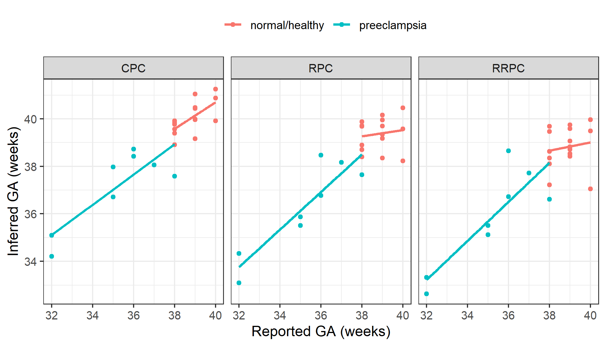

### Installation


```r
if(!requireNamespace("BiocManager", quietly = TRUE))
    install.packages("BiocManager")
BiocManager::install("planet")
```

### Set up

There are 3 gestational age clocks for placental DNA methylation data from Lee 
Y. et al. 2019:

1.  Robust Placental Clock (RPC)
2.  Control Placental Clock (CPC)
3.  Refined Robust Placental Clock (RRPC)

To predict gestational, we load the example data:

- `plBetas` - DNAm data for 24 placental samples
- `plPhenoData` - Matching sample information


```r
library(dplyr) # for data wrangling
library(ggplot2) #  plotting
library(tidyr) # for pivot_longer
library(planet)

# load example data
data("plPhenoData")
data("plBetas")
```

### Predict Gestational Age

To use each, we can specify the `type` argument in `predictAge`.

We will apply all three clocks on this data, and add the predicted age to the
sample information data.frame, `plPhenoData`.


```r
plPhenoData <- plPhenoData %>%
    mutate(
        ga_RPC = predictAge(plBetas, type = "RPC"),
        ga_CPC = predictAge(plBetas, type = "CPC"),
        ga_RRPC = predictAge(plBetas, type = "RRPC")
    )
#> 558 of 558 predictors present.
#> 546 of 546 predictors present.
#> 395 of 395 predictors present.
```

Note that the number of predictors (CpGs) that were used in our data are 
printed. It's important to take note if a significant number of predictive CpGs
are missing in your data, as this can affect the predicted gestational age
accuracy.

Next, I plot the difference between predicted and reported gestational age, for
each of the 3 gestational age predictors.


```r
plPhenoData %>%
    # reshape, to plot
    pivot_longer(
        cols = contains("ga"),
        names_to = "clock_type",
        names_prefix = "ga_",
        values_to = "ga"
    ) %>%

    ggplot(aes(x = gestation_wk, y = ga, col = disease)) +
    geom_point() +
    geom_smooth(method = "lm", se = FALSE) +
    facet_wrap(~clock_type) +
    theme(legend.position = "top") +
    labs(x = "Reported GA (weeks)", y = "Inferred GA (weeks)", col = "")
#> `geom_smooth()` using formula 'y ~ x'
```



*GA: gestational age*

### References

1.  [Lee Y, Choufani S, Weksberg R, Wilson SL, **Yuan V**, et al. Placental
    epigenetic clocks: estimating gestational age using placental DNA
    methylation levels. Aging (Albany NY). 2019;11(12):4238–4253.
    doi:10.18632/aging.102049](https://www.ncbi.nlm.nih.gov/pmc/articles/
    PMC6628997/)
    
### Session Info


```r
sessionInfo()
#> R Under development (unstable) (2020-12-18 r79646)
#> Platform: x86_64-w64-mingw32/x64 (64-bit)
#> Running under: Windows 10 x64 (build 19042)
#> 
#> Matrix products: default
#> 
#> locale:
#> [1] LC_COLLATE=English_Canada.1252 
#> [2] LC_CTYPE=English_Canada.1252   
#> [3] LC_MONETARY=English_Canada.1252
#> [4] LC_NUMERIC=C                   
#> [5] LC_TIME=English_Canada.1252    
#> 
#> attached base packages:
#> [1] stats4    parallel  stats     graphics  grDevices utils    
#> [7] datasets  methods   base     
#> 
#> other attached packages:
#>  [1] planet_0.99.1               tidyr_1.1.2                
#>  [3] dplyr_1.0.2                 EpiDISH_2.7.0              
#>  [5] bumphunter_1.33.0           locfit_1.5-9.4             
#>  [7] iterators_1.0.13            foreach_1.5.1              
#>  [9] Biostrings_2.59.2           XVector_0.31.1             
#> [11] SummarizedExperiment_1.21.1 Biobase_2.51.0             
#> [13] MatrixGenerics_1.3.0        matrixStats_0.57.0         
#> [15] GenomicRanges_1.43.1        GenomeInfoDb_1.27.3        
#> [17] IRanges_2.25.6              S4Vectors_0.29.6           
#> [19] BiocGenerics_0.37.0         ggplot2_3.3.3              
#> 
#> loaded via a namespace (and not attached):
#>  [1] nlme_3.1-151              bitops_1.0-6             
#>  [3] bit64_4.0.5               filelock_1.0.2           
#>  [5] progress_1.2.2            httr_1.4.2               
#>  [7] rprojroot_2.0.2           tools_4.1.0              
#>  [9] doRNG_1.8.2               utf8_1.1.4               
#> [11] R6_2.5.0                  mgcv_1.8-33              
#> [13] DBI_1.1.0                 colorspace_2.0-0         
#> [15] withr_2.3.0               tidyselect_1.1.0         
#> [17] prettyunits_1.1.1         bit_4.0.4                
#> [19] curl_4.3                  compiler_4.1.0           
#> [21] cli_2.2.0                 xml2_1.3.2               
#> [23] DelayedArray_0.17.7       labeling_0.4.2           
#> [25] rtracklayer_1.51.3        scales_1.1.1             
#> [27] quadprog_1.5-8            askpass_1.1              
#> [29] rappdirs_0.3.1            stringr_1.4.0            
#> [31] digest_0.6.27             Rsamtools_2.7.0          
#> [33] rmarkdown_2.6             htmltools_0.5.0          
#> [35] pkgconfig_2.0.3           sparseMatrixStats_1.3.2  
#> [37] highr_0.8                 dbplyr_2.0.0             
#> [39] rlang_0.4.9               rstudioapi_0.13          
#> [41] RSQLite_2.2.1             DelayedMatrixStats_1.13.2
#> [43] farver_2.0.3              BiocIO_1.1.2             
#> [45] generics_0.1.0            BiocParallel_1.25.2      
#> [47] RCurl_1.98-1.2            magrittr_2.0.1           
#> [49] GenomeInfoDbData_1.2.4    Matrix_1.3-2             
#> [51] fansi_0.4.1               Rcpp_1.0.5               
#> [53] munsell_0.5.0             lifecycle_0.2.0          
#> [55] stringi_1.5.3             yaml_2.2.1               
#> [57] MASS_7.3-53               zlibbioc_1.37.0          
#> [59] BiocFileCache_1.15.1      grid_4.1.0               
#> [61] blob_1.2.1                crayon_1.3.4             
#> [63] lattice_0.20-41           splines_4.1.0            
#> [65] GenomicFeatures_1.43.3    hms_0.5.3                
#> [67] knitr_1.30                pillar_1.4.7             
#> [69] rjson_0.2.20              rngtools_1.5             
#> [71] codetools_0.2-18          biomaRt_2.47.1           
#> [73] XML_3.99-0.5              glue_1.4.2               
#> [75] evaluate_0.14             vctrs_0.3.6              
#> [77] locfdr_1.1-8              gtable_0.3.0             
#> [79] openssl_1.4.3             purrr_0.3.4              
#> [81] assertthat_0.2.1          xfun_0.19                
#> [83] restfulr_0.0.13           e1071_1.7-4              
#> [85] class_7.3-17              tibble_3.0.4             
#> [87] GenomicAlignments_1.27.2  AnnotationDbi_1.53.0     
#> [89] memoise_1.1.0             ellipsis_0.3.1           
#> [91] here_1.0.1
```
